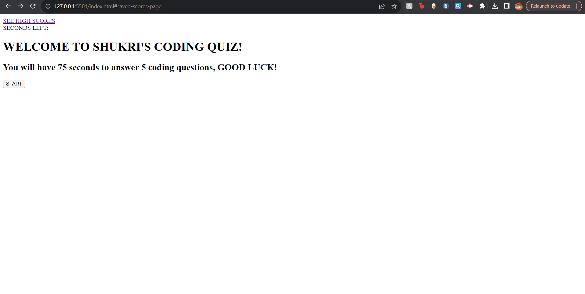

# week-4-quiz-challenge

## Description

- The reason I made this webpage was to familiarise myself with the skills learned in this module. And to do this create timed quiz on the basics of javascritp's fundamentals. This quiz displays 5 questions with 4 options each and counts down from 75 decrementing by 1 every second until it reaches 0 and then displays a page for the user to save their score under their initials and then proceed to view all the scores. It also decrements the time by 5 seconds everytime the user gets the question wrong.

## Process

- The first thing i did was scaffold out my webpage's structure in the index.html file by adding the header and different divs representing the different pages of the quiz. I also made sure to give all these elements id attributes that would allow me to identify and access them in the script.js file.

- Then i created a questions.js file which contains an array of all 5 of the questions in the quiz. Each question is in an object that contains the key value pairs for the question, the options and the answer.

- Afterwards in the script.js file i began by saving all the elements in the index.html file (that i wanted to later access in my javascript code ) in variables. I used the .getElementById method to do this.

- Then i set the display modes of the welcome page to 'block' and all the others to 'none' so only the welcome page would show when you first load the webpage.

- Next i added a click event listener to the start button element, the event handler function essentially sets the display function of the welcome page to 'none' and the quiz page to 'block', so only the quiz page is visible. I also set the text content of the timerSpan to 75 (representing 75 seconds). I then used the setInterval method to decrement the timerSpan's text content by 1 every 1000 milliseconds and if the timerSpan's text content was greater than 0. And when the timerSpan reached 0 a stopQuiz function will be called, so if the user doesnt answer all the questions before the timer then quiz still ends.

- So i created the stopQuiz function, in this function i set the display mode of the results page element to 'block' and the rest to 'none'. And the timerSpan text content as nothing ''.

- Then i started on the show quiz function who's purpose is to display the questions and options on the quiz page. So first i added an if statement that hasically says 'if the current question (which is set to 0 under the currentQuestion variable) is greater than of equal to the number of questions (5 in the questions.js questions array) then the quis has to stop (call the stop quiz function). I then dynamically created a ul element and appended it to the options element that was already in the html code. Next i set the options element to nothing '' so i could add the innerHTML via a for loop. The for loop iterates 5 times as there are 5 objects in the questions array and each time it sets the innerHTML of the question element (which displays the question on the quiz page) to be the question at the currentQuestionIndex position in the question's array. Then it creates a li element for each option in the current options array and sets its text content accordingly then appends that new li element to the ul element. This is so all the options are displayed as a list under the question on the quiz page.

- Then I added an event listener to the options div on the page, so that whenever someone clicks on an option (event.target.textContent) they are told if the answer in correct (questions[currentQuestionIndex].answer) or incorrect. In order to display these messages i used the setTimeOut method which essentially sets the messages text content to '' after 500 milliseconds. Making it so the messages only appear for half a second every time an option is clicked.

- I also added an event listener to the save button and inside the event handler i created a 'saveScores' function, this function creates gets whatever data is saved under the 'savedScores' key in the localStorage object and if there isnt anything in there (aka no users have saved their scores) then it creates an empty array and assigns it to the savedScores variable. Next i created an object called 'yourScore' which holds the value of the current user's initials (input.value) and their score (finalScore), then i pushed that object into the savedScores array and then saved that array into the local storage object under the key 'savedScores'.

- Next i added an event listener to the view scores button, inside the event handler function i set the display property of the saved scores page to block and the rest to none. Then i created a function called saveScores and in that function i use JSON.parse and .getItem to retrieve the array of user score objects saved under the key 'savedScores' and convert it into a regular array. Then i created a for loop that is the length of the savedScores array and so everytime it iterates it creates a new list item and sets its inner html to be the value of the content variable, then it appends each list item to the savedScoresPageEl (which is a ul element) so it appears as an unordered list. And lastly i invoked the showScores function.

## Webpage

- This is a screenshot of the deployed application:

- This is a link to the deployed webpage:

https://shukrim433.github.io/week-4-quiz-challenge/
